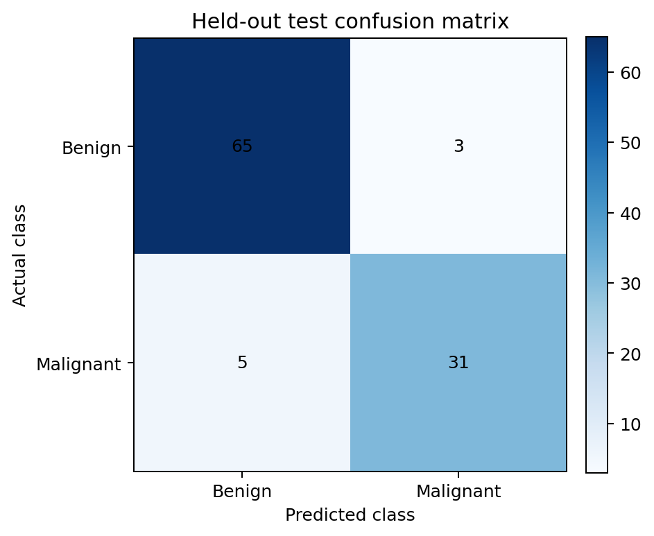
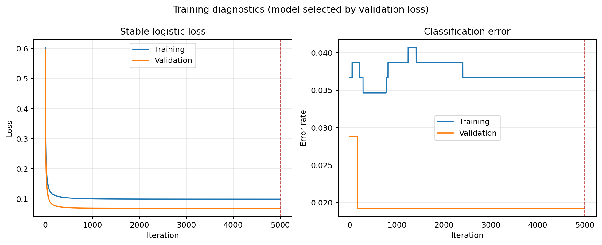

# Breast Cancer Two-Class Classifier from Scratch

This project implements a binary logistic-regression classifier using NumPy to
distinguish benign and malignant cytology observations in the **Breast Cancer
Wisconsin (Original)** dataset.

The repository develops the complete modelling workflow explicitly: data
loading, label conversion, grouped data splitting, feature standardisation,
stable logistic loss, analytical gradients, validation-based model selection,
classification metrics, saved model parameters, automated tests, and diagnostic
plots.

The project is intended to demonstrate the numerical foundations of binary
classification without relying on a machine-learning training framework. It is
an educational analysis and has not been clinically validated.

> **Medical disclaimer:** This repository must not be used for diagnosis,
> screening, treatment, triage, or any other medical decision.

## Main Aim

The main aim is to construct and evaluate a two-class linear classifier while
avoiding several common sources of misleading performance:

- reversing the benign and malignant class labels;
- evaluating the model on observations used for training;
- allowing repeated sample identifiers to cross data subsets;
- calculating preprocessing statistics from validation or test observations;
- selecting a model using the held-out test set;
- treating uncalibrated model outputs as clinical probabilities.

The model predicts

$$
y =
\begin{cases}
0, & \text{benign},\\
1, & \text{malignant}.
\end{cases}
$$

Malignant disease is treated as the positive class throughout the confusion
matrix and reported metrics.

## Dataset

The repository includes the **Breast Cancer Wisconsin (Original)** dataset from
the UCI Machine Learning Repository.

- Dataset record: https://archive.ics.uci.edu/dataset/15/breast%2Bcancer%2Bwisconsin%2Boriginal
- DOI: https://doi.org/10.24432/C5HP4Z
- Creator: William H. Wolberg
- Licence: Creative Commons Attribution 4.0 International

The unmodified source file is stored at

```text
data/raw/breast-cancer-wisconsin.data
```

Its SHA-256 checksum is recorded in

```text
data/raw/SHA256SUMS
```

The dataset contains 699 observations:

| Class | Original UCI label | Project label | Observations |
|---|---:|---:|---:|
| Benign | `2` | `0` | 458 |
| Malignant | `4` | `1` | 241 |

The explicit conversion from the original `2/4` coding prevents the semantic
label reversal present in the earlier coursework version.

Full provenance and transformation details are provided in
[`DATASET_ATTRIBUTION.md`](DATASET_ATTRIBUTION.md).

## Feature Set

The official dataset contains nine predictive cytology features. This project
reproduces the eight-feature scope of the original program by omitting
`Bare Nuclei`, the only feature containing missing values in the raw file.

The retained features are:

| Position | Feature |
|---:|---|
| 1 | Clump thickness |
| 2 | Uniformity of cell size |
| 3 | Uniformity of cell shape |
| 4 | Marginal adhesion |
| 5 | Single epithelial cell size |
| 6 | Bland chromatin |
| 7 | Normal nucleoli |
| 8 | Mitoses |

Each retained feature is an integer on the original scale from 1 to 10.

The sample code number is retained only as a grouping identifier. It is never
provided to the classifier as a predictive feature.

## What the Code Does

The default workflow:

1. reads the unchanged UCI data file;
2. validates the expected 11-column raw structure;
3. maps class `2` to benign and class `4` to malignant;
4. explicitly removes the `Bare Nuclei` feature;
5. checks the retained feature values and labels;
6. groups repeated sample code numbers;
7. creates deterministic training, validation, and test subsets;
8. verifies that a sample identifier cannot cross subsets;
9. fits the feature scaler using training observations only;
10. trains a NumPy logistic-regression model using an analytical gradient;
11. selects the saved weights using validation loss;
12. evaluates the selected model once on the held-out test subset;
13. writes metrics, model parameters, and training history to disk;
14. saves training and confusion-matrix figures;
15. evaluates three clearly labelled synthetic feature vectors;
16. prints a concise terminal summary.

## Linear Model

For a standardised feature vector $x$, the model calculates the linear score

$$
z = w_0 + x^T w,
$$

where:

- $w_0$ is the bias;
- $w$ contains the eight feature weights;
- $x$ contains the eight standardised feature values.

The sigmoid converts the score to the model output

$$
p(y=1\mid x)=\sigma(z)=\frac{1}{1+e^{-z}}.
$$

With the default threshold of $0.5$,

$$
\hat y =
\begin{cases}
1, & p(y=1\mid x)\geq0.5,\\
0, & p(y=1\mid x)<0.5.
\end{cases}
$$

Because the model has not been calibrated for clinical use, this output is
described as a **model probability**, not a clinical risk estimate.

## Stable Logistic Loss

For labels $y_i\in\{0,1\}$, the mean binary logistic loss is evaluated as

$$
J(w)
=
\frac{1}{N}\sum_{i=1}^{N}
\left[
\log\!\left(1+e^{z_i}\right)-y_i z_i
\right]
+
\frac{\lambda}{2}\sum_{j=1}^{d}w_j^2.
$$

The bias is not regularised. The implementation uses

```python
np.logaddexp(0.0, logits)
```

instead of evaluating `log(1 + exp(logits))` directly. This prevents numerical
overflow for large positive scores.

The gradient is calculated analytically:

$$
\nabla J(w)
=
\frac{1}{N}X^T\left(\sigma(Xw)-y\right)
+
\lambda w.
$$

No automatic-differentiation or machine-learning training package is required.

## Grouped Train, Validation, and Test Split

Repeated sample code numbers are treated as indivisible groups. A deterministic
greedy assignment balances class counts and subset sizes without placing the
same identifier in more than one subset.

The default split is:

| Subset | Target fraction | Observations | Benign | Malignant | Purpose |
|---|---:|---:|---:|---:|---|
| Training | 70% | 491 | 322 | 169 | Fit scaler and weights |
| Validation | 15% | 104 | 68 | 36 | Select model iteration |
| Test | 15% | 104 | 68 | 36 | Final held-out evaluation |

The random seed is fixed at `42`, making the assignment reproducible.

The test subset is not used to fit the scaler, update weights, stop training,
or choose the classification threshold.

## Feature Standardisation

Each feature is standardised using the training-subset mean and standard
deviation:

$$
x'_j=\frac{x_j-\mu_{j,\mathrm{train}}}{s_{j,\mathrm{train}}}.
$$

The same training statistics are then applied unchanged to the validation,
test, and synthetic observations. This prevents preprocessing information from
the held-out subsets leaking into training.

## Training and Model Selection

The default configuration is:

| Setting | Value |
|---|---:|
| Random seed | `42` |
| Learning rate | `0.1` |
| Maximum iterations | `5000` |
| L2 strength | `0.0` |
| Early-stopping patience | `250` |
| Minimum validation improvement | `1e-6` |
| Classification threshold | `0.5` |

At each iteration, the program records:

- training loss;
- validation loss;
- training error rate;
- validation error rate.

The saved weights correspond to the lowest validation loss. Training can stop
early when the validation loss fails to improve sufficiently for the configured
patience period.

L2 regularisation remains available through the command-line option
`--l2-strength`, although the reference run uses `0.0`.

## Evaluation Metrics

The confusion matrix uses malignant disease as the positive class:

| | Predicted malignant | Predicted benign |
|---|---:|---:|
| Actual malignant | True positive | False negative |
| Actual benign | False positive | True negative |

The reported metrics include:

$$
\mathrm{Accuracy}
=
\frac{TP+TN}{TP+TN+FP+FN},
$$

$$
\mathrm{Precision}_{\mathrm{malignant}}
=
\frac{TP}{TP+FP},
$$

$$
\mathrm{Recall}_{\mathrm{malignant}}
=
\frac{TP}{TP+FN},
$$

$$
\mathrm{Specificity}_{\mathrm{benign}}
=
\frac{TN}{TN+FP},
$$

and

$$
\mathrm{Balanced\ accuracy}
=
\frac12
\left(
\mathrm{Recall}_{\mathrm{malignant}}
+
\mathrm{Specificity}_{\mathrm{benign}}
\right).
$$

The F1 score for the malignant class is also reported.

## Default Held-Out Results

Using the default configuration, the selected iteration is `4993`.

The held-out test confusion matrix is:

| | Predicted malignant | Predicted benign |
|---|---:|---:|
| Actual malignant | 31 | 5 |
| Actual benign | 3 | 65 |

The corresponding test metrics are:

| Metric | Result |
|---|---:|
| Accuracy | 92.31% |
| Malignant precision | 91.18% |
| Malignant recall | 86.11% |
| Benign specificity | 95.59% |
| Malignant F1 score | 88.57% |
| Balanced accuracy | 90.85% |



These values describe one fixed educational holdout split. They are not a
clinical validation result and should not be interpreted as evidence of safety
or generalisability.

The complete machine-readable reference results are stored in
[`results/default_metrics.json`](results/default_metrics.json).

## Training Diagnostics

The training diagnostic compares training and validation loss and error rate.
The dashed vertical line marks the iteration whose validation loss was lowest.



The loss curves fall rapidly during the early iterations and then improve more
gradually. Classification error changes in discrete steps because it depends on
whether each model output lies above or below the threshold.

## Synthetic Examples

The program retains three synthetic feature vectors, labelled `A`, `B`, and
`C`, to demonstrate how fitted preprocessing and prediction are applied to new
inputs.

For each vector, the output records:

- the eight feature values;
- the predicted class;
- the uncalibrated model probability assigned to the malignant class;
- an explicit educational-use warning.

These vectors do not represent real patients. Their outputs are illustrations
of program behaviour, not medical assessments.

## Generated Outputs

The default command writes the following files to `outputs/`:

| File | Description |
|---|---|
| `metrics.json` | Configuration, split sizes, metrics, and synthetic outputs |
| `training_history.csv` | Loss and error rate at every training iteration |
| `model.npz` | Selected weights, scaler values, feature names, and threshold |
| `training_diagnostics.png` | Training and validation curves |
| `test_confusion_matrix.png` | Held-out test confusion matrix |

The `outputs/` directory is excluded from version control because all files can
be reproduced by running the program. The reference metrics and figures used in
this README are stored separately under `results/` and `assets/`.

## Repository Contents

```text
.
├── .github/
│   └── workflows/
│       └── tests.yml
├── assets/
│   ├── test_confusion_matrix.png
│   └── training_diagnostics.png
├── data/
│   └── raw/
│       ├── SHA256SUMS
│       └── breast-cancer-wisconsin.data
├── results/
│   └── default_metrics.json
├── scripts/
│   └── prepare_data.py
├── tests/
│   ├── test_classifier.py
│   └── test_data_pipeline.py
├── .gitignore
├── DATASET_ATTRIBUTION.md
├── README.md
├── SAFETY.md
├── breast_cancer_classifier.py
└── requirements.txt
```

## Requirements

- Python 3.10 or later
- NumPy
- Matplotlib

Install the runtime dependencies using

```bash
python -m pip install -r requirements.txt
```

## Running the Project

From the repository root, run

```bash
python breast_cancer_classifier.py
```

This trains the model, prints the held-out metrics, and writes the generated
files to `outputs/`.

To choose another output directory, use

```bash
python breast_cancer_classifier.py --output-dir outputs/experiment_01
```

To run without creating figures, use

```bash
python breast_cancer_classifier.py --no-plots
```

A custom experiment can be configured from the command line:

```bash
python breast_cancer_classifier.py \
    --seed 7 \
    --learning-rate 0.05 \
    --max-iterations 3000 \
    --l2-strength 0.001 \
    --patience 200 \
    --threshold 0.5 \
    --output-dir outputs/custom_run
```

Display every available option using

```bash
python breast_cancer_classifier.py --help
```

## Preparing a Conventional CSV

The main program reads the official raw file directly. An optional preparation
script creates a conventional row-oriented CSV with named columns:

```bash
python scripts/prepare_data.py
```

The generated file is written to

```text
data/processed/breast_cancer_wisconsin_8_feature.csv
```

Its columns are:

```text
sample_id,
clump_thickness,
uniformity_of_cell_size,
uniformity_of_cell_shape,
marginal_adhesion,
single_epithelial_cell_size,
bland_chromatin,
normal_nucleoli,
mitoses,
diagnosis
```

The preparation script refuses to overwrite an existing output unless the
`--force` option is supplied. It never modifies the raw source file.

## Running the Tests

Run the complete unit-test suite using

```bash
python -m unittest discover -s tests -v
```

The tests verify:

- the dataset dimensions and class counts;
- the correct benign and malignant semantics;
- the explicit omission of `Bare Nuclei`;
- finite feature values and expected feature range;
- deterministic grouped splitting;
- absence of sample-ID overlap between subsets;
- approximate class balance in every subset;
- training-only standardisation behaviour;
- non-destructive CSV preparation;
- numerical stability for extreme model scores;
- decreasing loss on a separable toy problem;
- confusion-matrix and metric definitions.

The same checks run automatically through the GitHub Actions workflow on Python
3.10 and Python 3.12.

## Main Components

| Component | Description |
|---|---|
| `TrainingConfig` | Stores and validates reproducible experiment settings |
| `Dataset` | Stores features, labels, sample IDs, and feature names |
| `StandardScaler` | Fits and applies training-only standardisation |
| `BinaryLogisticRegression` | Trains the model with an analytical gradient |
| `load_dataset()` | Parses and validates the official raw data |
| `grouped_stratified_split()` | Creates leakage-resistant data subsets |
| `stable_sigmoid()` | Evaluates the sigmoid without numerical overflow |
| `logistic_loss()` | Calculates stable binary loss and optional L2 penalty |
| `classification_metrics()` | Calculates the binary evaluation metrics |
| `run_experiment()` | Executes the complete experiment and writes outputs |

## Reproducibility

The reference run is reproducible because:

- the raw data file is included unchanged;
- its SHA-256 checksum is recorded;
- preprocessing is deterministic;
- the grouped split uses a fixed seed;
- feature scaling is fitted only on the training subset;
- configuration values are saved with the results;
- selected model parameters are written to `model.npz`;
- the reference metrics are stored in machine-readable form;
- tests cover data, optimisation, splitting, and metric semantics.

Changing the random seed, regularisation strength, learning rate, iteration
limit, or threshold can change the fitted model and reported metrics.

## Important Limitations

### Educational scope

The implementation is designed to expose the main numerical steps of binary
classification. It is not a production machine-learning system.

### Historical dataset

The dataset is small and historical. Its observations do not establish
performance for contemporary populations, laboratories, acquisition methods,
or clinical workflows.

### Omitted feature

`Bare Nuclei` is intentionally omitted to preserve the eight-feature scope of
the original experiment. A different project could retain it using a clearly
defined missing-data strategy fitted on the training subset.

### Single holdout split

The default results come from one deterministic grouped split. Repeated grouped
cross-validation would provide a more complete estimate of variation across
possible data partitions.

### Uncalibrated outputs

The sigmoid outputs have not been tested for clinical calibration. They must not
be interpreted as individual risk estimates.

### Threshold selection

The default threshold is fixed at `0.5`. The repository does not optimise a
clinical operating point or assign different costs to false negatives and false
positives.

### Fairness and generalisability

The available variables do not support a comprehensive assessment of subgroup
fairness, external validity, or dataset shift.

### No clinical validation

The model has not undergone prospective validation, regulatory review, clinical
integration testing, or safety monitoring. See [`SAFETY.md`](SAFETY.md) for the
full responsible-use statement.

## Expected Behaviour

A successful default run should:

- load 699 observations and eight features;
- identify 458 benign and 241 malignant observations;
- create training, validation, and test subsets without sample-ID overlap;
- fit the scaler using training observations only;
- reduce training and validation loss;
- select a model using validation loss;
- report metrics for all three subsets;
- produce a held-out test confusion matrix;
- write model parameters and training history;
- reproduce the reference result when software versions and configuration are
  unchanged.

Small floating-point differences can occur across platforms, but the class
semantics, split membership, and evaluation definitions should remain unchanged.

## Dataset Citation

If this dataset is used in derived work, cite:

> Wolberg, W. (1990). *Breast Cancer Wisconsin (Original)* [Dataset]. UCI
> Machine Learning Repository. https://doi.org/10.24432/C5HP4Z

The dataset is distributed under the Creative Commons Attribution 4.0
International licence. See [`DATASET_ATTRIBUTION.md`](DATASET_ATTRIBUTION.md)
for complete attribution and transformation details.
